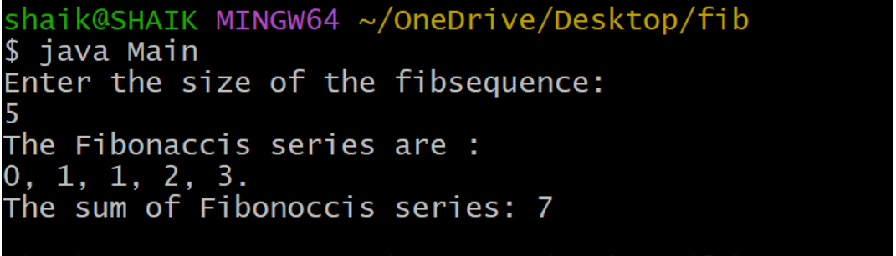
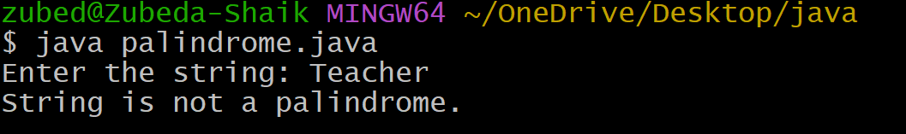
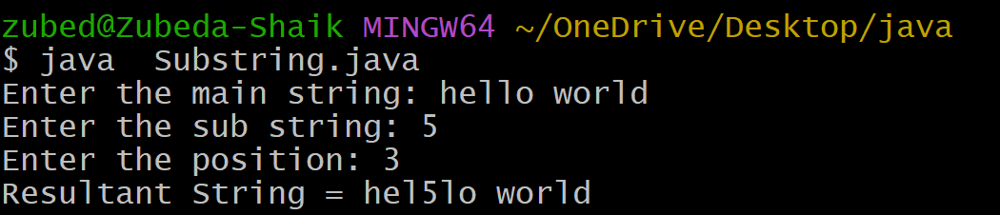
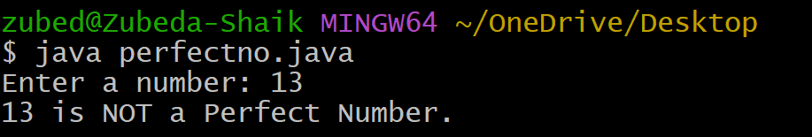

# EXPERIMENT-2:
# 2)Title: Find the sum of the first n fibonacci numbers.
# Source code:
``` java
class Fibonacci{
  int firstNumber;
  int secondNumber;
  int thirdNumber;
  int sum;
  int sizeoffibsequence;
  Fibonacci(int size){
    firstNumber = 0;
    secondNumber = 1;
    thirdNumber = 0;
    sum = 0;
    sizeoffibsequence=size;
  }
  void generateFibSequence(){
    while(sizeoffibsequence>0){
      if(sizeoffibsequence==1)
        System.out.print(firstNumber +".");
      else
        System.out.print(firstNumber + ", ");
        sum+=firstNumber;
        thirdNumber=secondNumber+firstNumber;
        firstNumber=secondNumber;
        secondNumber=thirdNumber;
        sizeoffibsequence--;
    }
  }
  int getFibSum(){
    if(sum>0)
      return sum;
    else{
      generateFibSequence();
      return sum;
    }
  }
}
              
import java.util.Scanner;
class Main{
  public static void main(String args[]){
    System.out.println("Enter the size of the fibsequence:");
    Scanner sc=new Scanner(System.in);
    int size=sc.nextInt();
    if(size>0){
      Fibonacci fib = new Fibonacci(size);
      System.out.println("The Fibonaccis series are : ");
      fib.generateFibSequence();
      System.out.println("\nThe sum of Fibonoccis series: " + fib.getFibSum());
    }
    else
    System.out.println("if cannot caluclate the Fibonoccis series and sum");
  }
}
```
# output:

# EXPERIMENT-1
# Tilte: Write a java program to insert a sub string into a given main string from a given position.
# SourceCode:
``` java
import java.util.Scanner;
class SubStringInsert {
    public static void main(String[] args) {

        String mainString, subString;
        int position;
        Scanner sc = new Scanner(System.in);
        System.out.print("Enter the main string: ");
        mainString = sc.nextLine();
        System.out.print("Enter the sub string: ");
        subString = sc.nextLine();
        System.out.print("Enter the position: ");
        position = sc.nextInt();
        int length = mainString.length()-1;
        String resultString;
        if (position >= 0 && position <= length) {

            String firstPart = mainString.substring(0, position);
            String secondPart = mainString.substring(position);
            resultString = firstPart + subString + secondPart;
            System.out.println("Resultant String = " + resultString);
        } 
        else {
            System.out.println("Substring is not possible to insert");
            System.out.println("Condition: 0 <= position <= length of main string");
        }
        sc.close();
    }
}
```
# Output:


# EXPERIMENT-3
# Title:write a java program to implement the given string is palindrome or not.
# Sourcecode:
```` java
import java.util.Scanner;
class Palindrome {
    public static void main(String[] args) {

        String str;
        Scanner sc = new Scanner(System.in);
        System.out.print("Enter the string: ");
        str = sc.nextLine();
        int start = 0;
        int end = str.length() - 1;
        boolean flag = true;
        while (start < end) {
            if (str.charAt(start) != str.charAt(end)) {
                System.out.println("String is not a palindrome.");
                flag = false;
                break;
            }
            start++;
            end--;
        }

        if (flag) {
            System.out.println("String is a palindrome.");
        }

        sc.close();
    }
}

````
# OUTPUT:



# EXPERIMENT-4
# Title:Write a java program to implement a perfect number.
# Source code:
``` java
import java.util.Scanner;

class PerfectNumber {
    public static void main(String args[]) {
        int num, sum = 0;
        Scanner sc = new Scanner(System.in);
        System.out.print("Enter a number: ");
        num = sc.nextInt();
        for (int i = 1; i < num; i++) {
            if (num % i == 0) {
                sum = sum + i;
            }
        }
        if (sum == num) {
            System.out.println(num + " is a perfect number.");
        } else {
            System.out.println(num + " is not a perfect number.");
        }

        sc.close();
    }
}

 ```
# Output:

